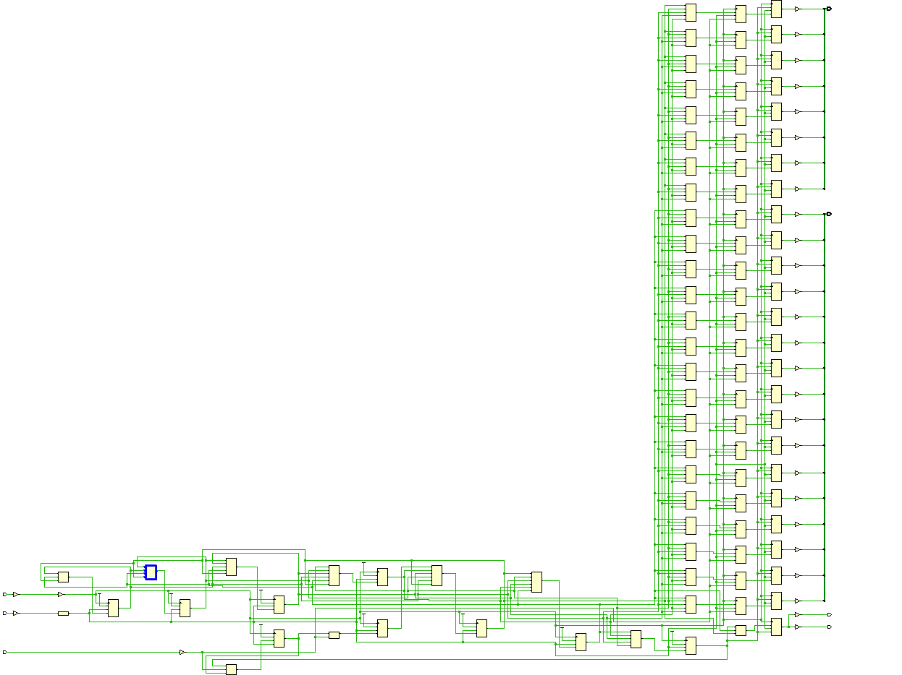

# SDAM.v 是Serial Data Access Module
功能是依序接收序列資料及位址,並在收到序列資料及位址後將之轉成並列資料輸出(dout)及並列位址輸出(aout)

# testbench.v 是測試檔
- T1. 一開始將 sda 設為 1,此時系統為閒置的狀態。  
- T2. 當時脈正緣時,Testbench 將 sda 設為 0 表示指令觸發;SDAM 開始執
行指令動作。  
- T3. 由 sda 位準為 1 或 0 來指示要進行何種動作。1 表示寫入資料;0 表
示讀取資料,本題只會出現 1。  
- T4-T5. 這段時間共有 8 個時脈週期,Testbench 依序將 Address 利用 sda 由
LSB 序列送入 SDAM;在這區間內 SDAM 需要將 sda 的訊號收
集起來成為 Address。  
- T6-T7. 這段時間共有 16 個時脈週期,Testbench 依序將 Data 利用 sda 由
LSB 序列送入 SDAM,在這區間內,SDAM 需要將 sda 的訊號收
集起來成為 Data。  
- T8. 此時 Address 和 Data 應該已經收集完成。接下來 Testbench 會再次將
sda 設為 1,表示系統再次回到閒置的狀態。等同 T1 時間點。於 T8
之後,SDAM 須將 avalid 及 dvalid 設為 1 表示此時輸出的 aout 及
dout 為有效輸出(avalid 和 dvalid 僅可以持續一個 scl 週期),且此
時 aout 將輸出 address 而 dout 則輸出 data。Testbench 偵測到這筆
輸出後,會立刻進行結果比對,之後才會有下一筆資料輸入。若 avalid
或 dvalid 沒有設定為 1,則 testbench 將會進行等待動作,電路將不會
下一筆輸入。  
- T9. 當時脈正緣時,Testbench 將 sda 設為 0 表示指令觸發,SDAM 開始
執行下一筆指令動作。等同 T2。

# result
## simulation                      
simulation會測試32筆資料(Pattern_sti.dat)，console會顯示通過

Congratulations! All data have been generated successfully!

-------------------------PASS------------------------

## synthesis
expect netlist

